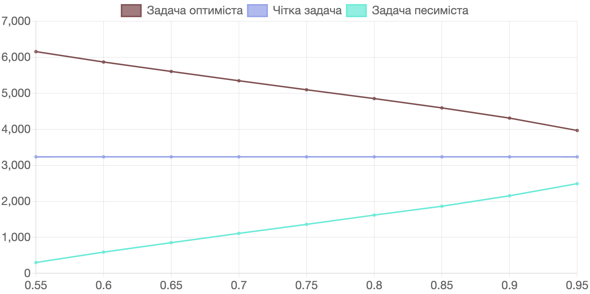

# 5. порівняльний аналіз результатів рішення задачі в чіткій і нечіткій постановці.

Отже в попередньому розділі ми отримали наступні результати рішення чіткої задачі та задач песиміста та оптиміста. 

Розподіл виробничої програми між підприємствами виглядає ідентичним як для чіткої задачі, так і задач песиміста та оптиміста, а саме:

$$ x_{13} = 4.00, x_{23} = 43.00, x_{35} = 5.00, x_{11} = 10.00, x_{32} = 4.00$$
$$ x_{33} = 12.00, x_{34} = 7.00 $$

Для більшої наочності результати розподілу виробничої програми наведено у таблиці 5.1. 

#### Таблиця 5.1. Розподіл виробничої програми між підприємствами як для чіткої задачі, так і задач песиміста та оптиміста.

<table>
    <thead>
        <tr>
            <th class="cell"></th>    
            <th class="cell">Тип 1</th>    
            <th class="cell">Тип 2</th>    
            <th class="cell">Тип 3</th>    
            <th class="cell">Тип 4</th>    
            <th class="cell">Тип 5</th>    
        </tr>
    </thead>
    <tbody>
        <tr>
            <td class="cell">Виріб 1</td>    
            <td class="cell">10</td>    
            <td class="cell"></td>    
            <td class="cell">4</td>    
            <td class="cell"></td>    
            <td class="cell"></td>    
        </tr>
        <tr>
            <td class="cell">Виріб 2</td>    
            <td class="cell"></td>    
            <td class="cell"></td>    
            <td class="cell">43</td>    
            <td class="cell"></td>    
            <td class="cell"></td>    
        </tr>
        <tr>
            <td class="cell">Виріб 3</td>    
            <td class="cell"></td>    
            <td class="cell">4</td>    
            <td class="cell">12</td>    
            <td class="cell">7</td>    
            <td class="cell">5</td>    
        </tr>
        <tr class="font-bold">
            <td class="cell">Застосована кількість підприємств</td>    
            <td class="cell">10</td>    
            <td class="cell">4</td>    
            <td class="cell">59</td>    
            <td class="cell">7</td>    
            <td class="cell">5</td>    
        </tr>
        <tr>
            <td class="cell">Наявна кількість підприємств</td>    
            <td class="cell">10</td>    
            <td class="cell">4</td>    
            <td class="cell">60</td>    
            <td class="cell">7</td>    
            <td class="cell">5</td>    
        </tr>
    </tbody>
</table>

Натомість кількість вироблених комплектів виробів відрізняється. Для чіткої задачі вона дорівнює 3235 комплектів, для задачі песиміста - 1617 комплектів, для задачі оптиміста - 4853 комплекти. 

Це легко пояснити тим фактом, що місячна продуктивність кожного підприємства є нечіткою випадковою величиною з функцією приналежності, яка задана однією і тією ж функцією, а саме:

$$ \mu_{ij}(a_{ij}) = \frac{1}{1 + \frac{(a_{ij} - \overline{a}_{ij})^2}{\overline{a}_{ij}^2}} $$

Якщо ми запишемо детермінований еквівалент задачі, який забезпечує максимальний випуск комплектної продукції ймовірністю не меншою ніж $\alpha_0$, та вирішимо нерівність і знайдемо кінці інтервалу нечіткої множини $a_{ij}$ рівня $\alpha_0$, то отримаємо наступну нерівність:

$$ \left(1 - \sqrt{\frac{1-\alpha_0}{\alpha_0}} \right) \overline{a}_{ij} \le a_{ij} \le \left( 1+ \sqrt{\frac{1-\alpha_0}{\alpha_0}} \right) \overline{a}_{ij}$$

Легко побачити, що границі інтервалу кожної нечіткої величини продуктивності підприємства зазначеного типу при виробництві виробу зазначеного типу прямо пропорційні середньому значенню величини означеної продуктивності, та залежать лише від значення заданої ймовірності $\alpha_0$.

Отже можна казати, що для задачі, що розглядається у даній роботі існують наступні закономірності:

- при зміні рівня недомінованості альтернатив буде змінюватися лише кількість вироблених комплектів виробів, а розподіл виробничої програми між підприємствами залишається тим самим;
- розподіл виробничої програми між підприємствами залежить від середніх значень продуктивності підприємства зазначеного типу при виробництві виробу зазначеного типу і не залежить від ступеню недомінованості.

Програмний продукт, розроблений в ході даної роботи, також дозволяє розрахувати кількість вироблених комплектів для задач песиміста та оптиміста при різних значеннях ступеню недомінованості. У таблиці 5.2 наведено значення кількості вироблених комплектів для задач песиміста та оптиміста при зміні ступеню недомінованості в інтервалі віж 0.55 до 0.95 з кроком 0.5. Для наочності у таблицю додано рядок із значенням кількості вироблених комплектів для чіткої задачі.

#### Таблиця 5.2. Кількості вироблених комплектів для задач песиміста та оптиміста при зміні ступеню недомінованості.
<table>
    <thead>
        <tr>
            <th  class="cell">Значення ступеню недомінованості</th>
            <th  class="cell">0.55</th>
            <th  class="cell">0.6</th>
            <th  class="cell">0.65</th>
            <th  class="cell">0.7</th>
            <th  class="cell">0.75</th>
            <th  class="cell">0.8</th>
            <th  class="cell">0.85</th>
            <th  class="cell">0.9</th>
            <th  class="cell">0.95</th>
        </tr>
    </thead>
    <tbody>
        <tr>
            <td  class="cell">Задача оптиміста</td>
            <td  class="cell">6157</td>
            <td  class="cell">5868</td>
            <td  class="cell">5606</td>
            <td  class="cell">5348</td>
            <td  class="cell">5098</td>
            <td  class="cell">4853</td>
            <td  class="cell">4594</td>
            <td  class="cell">4311</td>
            <td  class="cell">3967</td>
        </tr>
        <tr>
            <td  class="cell">Чітка задача</td>
            <td  class="cell">3235</td>
            <td  class="cell">3235</td>
            <td  class="cell">3235</td>
            <td  class="cell">3235</td>
            <td  class="cell">3235</td>
            <td  class="cell">3235</td>
            <td  class="cell">3235</td>
            <td  class="cell">3235</td>
            <td  class="cell">3235</td>
        </tr>
        <tr>
            <td  class="cell">Задача песиміста</td>
            <td  class="cell">300</td>
            <td  class="cell">589</td>
            <td  class="cell">851</td>
            <td  class="cell">1109</td>
            <td  class="cell">1359</td>
            <td  class="cell">1617</td>
            <td  class="cell">1863</td>
            <td  class="cell">2153</td>
            <td  class="cell">2490</td>
        </tr>
    </tbody>
</table>

На основі даних, наведених у таблиці 5.2. побудовано графіки, які ще наочніше відображають дані, отримані за допомогою розробленої програми. Графіки наведено нижче на рисунку 5.1.

#### Рис. 5.1. Графік змін кількості вироблених комплектів для задачі оптиміста, чіткої задачі та задачі песиміста в залежності від зміни значення ступеню недомінованості.

