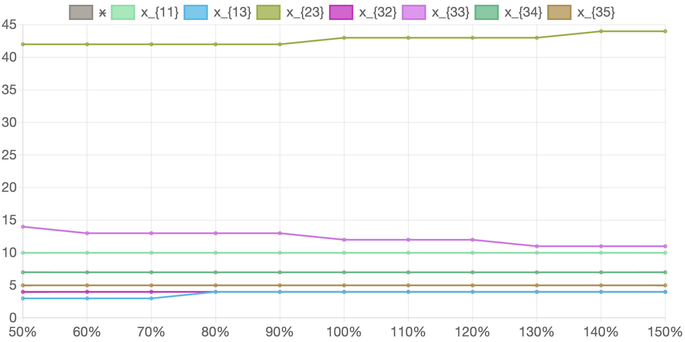

# 6. Оцінка чутливості отриманого рішення до варіації параметрів завдання

У попередньому розділі ми дослідили як впливає рівень недомінованості альтернатив на кількість вироблених комплектів виробів та розподіл виробничої програми між підприємствами. У цьому розділі ми спробуємо дослідити як на рішення впливають зміни інших параметрів задачі.

Для цього за допомогою розробленого в ході даної роботи програмного продукту ми проведемо декілька експериментів, змінюючи деякі вихідні параметри задачі, отримаємо дані розв'язків, проаналізуємо їх та побудуємо відповідні таблиці та графіки. Отже ми розглянемо наступні експерименти:

- зміна продуктивності виробництва на підприємствах зазначеного типу для усіх типів продуктів у відсотках від початкових значень;
- зміна продуктивності виробництва зазначеного виробу на підприємствах усіх типів у відсотках від початкових значень;
- зміна кількості виробів зазначеного типу у комплекті;
- зміни загальної кількості підприємств зазначеного типу типу.

## 6.1. Зміна продуктивності виробництва на підприємствах зазначеного типу для усіх типів продуктів у відсотках від початкових значень.

На наш погляд цілком доцільно розглянути ситуацію, коли завдяки зовнішнім чинникам продуктивність підприємств деякого типу може зрости, наприклад, за рахунок модернізації, раціоналізації, інновацій чи інвестицій, чи навпаки, знизитися, наприклад, завдяки подорожчанню енергоносіїв, які використовуються саме на підприємствах зазначеного типу. З метою спрощення моделювання та розрахунків припустимо, що продуктивність змінюється однаково пропорційно для всіх підприємств зазначеного типу незалежно від типу виробу, що виготовляється.

Розроблений у ході даної роботи програмний продукт дозволяє знайти рішення вихідної задачі, якщо продуктивність підприємств якогось обраного типу буде змінюватися у проміжку від 50% до 150% відсотків від початкової. У таблиці 6.1. наведено значення змінних які будуть змінюватися у ході експерименту.

#### Таблиця 6.1. Вихідні значення експерименту при зміні продуктивності виробництва на підприємствах 1-го типу для усіх типів продуктів у відсотках від початкових значень

<table>
    <thead>
        <tr>
            <th>Відсоток зміни продуктивності на підприємствах 1-го типу</th>
            <th>50%</th>
            <th>60%</th>
            <th>70%</th>
            <th>80%</th>
            <th>90%</th>
            <th>100%</th>
            <th>110%</th>
            <th>120%</th>
            <th>130%</th>
            <th>140%</th>
            <th>150%</th>
        </tr>
    </thead>
    <tbody>
        <tr>
            <td><math>
                                        <semantics>
                                            <mrow>
                                                <msub>
                                                    <mi>a</mi>
                                                    <mn>11</mn>
                                                </msub>
                                            </mrow>
                                            <annotation encoding="application/x-tex">a_{11}</annotation>
                                        </semantics>
                                    </math>a11​
            </td>
            <td>100</td>
            <td>120</td>
            <td>140</td>
            <td>160</td>
            <td>180</td>
            <td>200</td>
            <td>220</td>
            <td>240</td>
            <td>260</td>
            <td>280</td>
            <td>300</td>
        </tr>
        <tr>
            <td><math>
                                        <semantics>
                                            <mrow>
                                                <msub>
                                                    <mi>a</mi>
                                                    <mn>21</mn>
                                                </msub>
                                            </mrow>
                                            <annotation encoding="application/x-tex">a_{21}</annotation>
                                        </semantics>
                                    </math>a21​
            </td>
            <td>35</td>
            <td>42</td>
            <td>49</td>
            <td>56</td>
            <td>63</td>
            <td>70</td>
            <td>77</td>
            <td>84</td>
            <td>91</td>
            <td>98</td>
            <td>105</td>
        </tr>
        <tr>
            <td><math>
                                        <semantics>
                                            <mrow>
                                                <msub>
                                                    <mi>a</mi>
                                                    <mn>31</mn>
                                                </msub>
                                            </mrow>
                                            <annotation encoding="application/x-tex">a_{31}</annotation>
                                        </semantics>
                                    </math>a31​
            </td>
            <td>30</td>
            <td>36</td>
            <td>42</td>
            <td>48</td>
            <td>54</td>
            <td>60</td>
            <td>66</td>
            <td>72</td>
            <td>78</td>
            <td>84</td>
            <td>90</td>
        </tr>
    </tbody>
</table>

Кількість вироблених комплектів виробів та розподіл виробничої програми між підприємствами при зміні продуктивності на підприємствах 1-го типу  наведено у таблиці 6.2. Відповідні графіки наведено на рисунку 6.1.

#### Таблиця 6.2. Значення розв'язку задачі в залежності від зміни продуктивності на підприємствах 1-го типу для усіх продуктів у відсотках від початкових значень

<table>
    <thead>
        <tr>
            <th>Відсоток зміни продуктивності на підприємствах 1-го типу</th>
            <th>50%</th>
            <th>60%</th>
            <th>70%</th>
            <th>80%</th>
            <th>90%</th>
            <th>100%</th>
            <th>110%</th>
            <th>120%</th>
            <th>130%</th>
            <th>140%</th>
            <th>150%</th>
        </tr>
    </thead>
    <tbody>
        <tr>
            <td>x</td>
            <td>3144</td>
            <td>3162</td>
            <td>3180</td>
            <td>3199</td>
            <td>3217</td>
            <td>3235</td>
            <td>3253</td>
            <td>3271</td>
            <td>3289</td>
            <td>3308</td>
            <td>3326</td>
        </tr>
        <tr>
            <td><math>
                                        <semantics>
                                            <mrow>
                                                <msub>
                                                    <mi>x</mi>
                                                    <mn>11</mn>
                                                </msub>
                                            </mrow>
                                            <annotation encoding="application/x-tex">x_{11}</annotation>
                                        </semantics>
                                    </math>x11​
            </td>
            <td>10</td>
            <td>10</td>
            <td>10</td>
            <td>10</td>
            <td>10</td>
            <td>10</td>
            <td>10</td>
            <td>10</td>
            <td>10</td>
            <td>10</td>
            <td>10</td>
        </tr>
        <tr>
            <td><math>
                                        <semantics>
                                            <mrow>
                                                <msub>
                                                    <mi>x</mi>
                                                    <mn>13</mn>
                                                </msub>
                                            </mrow>
                                            <annotation encoding="application/x-tex">x_{13}</annotation>
                                        </semantics>
                                    </math>x13​
            </td>
            <td>7</td>
            <td>6</td>
            <td>5</td>
            <td>5</td>
            <td>4</td>
            <td>4</td>
            <td>3</td>
            <td>2</td>
            <td>2</td>
            <td>1</td>
            <td>1</td>
        </tr>
        <tr>
            <td><math>
                                        <semantics>
                                            <mrow>
                                                <msub>
                                                    <mi>x</mi>
                                                    <mn>23</mn>
                                                </msub>
                                            </mrow>
                                            <annotation encoding="application/x-tex">x_{23}</annotation>
                                        </semantics>
                                    </math>x23​
            </td>
            <td>41</td>
            <td>42</td>
            <td>42</td>
            <td>42</td>
            <td>42</td>
            <td>43</td>
            <td>43</td>
            <td>43</td>
            <td>43</td>
            <td>44</td>
            <td>44</td>
        </tr>
        <tr>
            <td><math>
                                        <semantics>
                                            <mrow>
                                                <msub>
                                                    <mi>x</mi>
                                                    <mn>32</mn>
                                                </msub>
                                            </mrow>
                                            <annotation encoding="application/x-tex">x_{32}</annotation>
                                        </semantics>
                                    </math>x32​
            </td>
            <td>4</td>
            <td>4</td>
            <td>4</td>
            <td>4</td>
            <td>4</td>
            <td>4</td>
            <td>4</td>
            <td>4</td>
            <td>4</td>
            <td>4</td>
            <td>4</td>
        </tr>
        <tr>
            <td><math>
                                        <semantics>
                                            <mrow>
                                                <msub>
                                                    <mi>x</mi>
                                                    <mn>33</mn>
                                                </msub>
                                            </mrow>
                                            <annotation encoding="application/x-tex">x_{33}</annotation>
                                        </semantics>
                                    </math>x33​
            </td>
            <td>10</td>
            <td>11</td>
            <td>11</td>
            <td>12</td>
            <td>12</td>
            <td>12</td>
            <td>13</td>
            <td>13</td>
            <td>13</td>
            <td>14</td>
            <td>14</td>
        </tr>
        <tr>
            <td><math>
                                        <semantics>
                                            <mrow>
                                                <msub>
                                                    <mi>x</mi>
                                                    <mn>34</mn>
                                                </msub>
                                            </mrow>
                                            <annotation encoding="application/x-tex">x_{34}</annotation>
                                        </semantics>
                                    </math>x34​
            </td>
            <td>7</td>
            <td>7</td>
            <td>7</td>
            <td>7</td>
            <td>7</td>
            <td>7</td>
            <td>7</td>
            <td>7</td>
            <td>7</td>
            <td>7</td>
            <td>7</td>
        </tr>
        <tr>
            <td><math>
                                        <semantics>
                                            <mrow>
                                                <msub>
                                                    <mi>x</mi>
                                                    <mn>35</mn>
                                                </msub>
                                            </mrow>
                                            <annotation encoding="application/x-tex">x_{35}</annotation>
                                        </semantics>
                                    </math>x35​
            </td>
            <td>5</td>
            <td>5</td>
            <td>5</td>
            <td>5</td>
            <td>5</td>
            <td>5</td>
            <td>5</td>
            <td>5</td>
            <td>5</td>
            <td>5</td>
            <td>5</td>
        </tr>
    </tbody>
</table>

#### Рисунок 6.1. Графік змін розв'язку задачі в залежності від зміни продуктивності на підприємствах 1-го типу для усіх продуктів у відсотках від початкових значень

Як можна побачити з отриманих даних зміна продуктивності підприємств першого типу не здійснює значного впливу ні на кількість вироблених комплектів виробів, ні на розподіл виробничої програми між підприємствами. 

При зменшенні продуктивності на 50% кількість вироблених комплектів знижується лише приблизно на 3%. Щодо розподілу виробничої програми, зростає кількість підприємств третього типу, які орієнтовані на виготовлення виробу першого типу, та відповідно знижується кількість підприємств третього типу, орієнтованих на виготовлення виробів другого та третього типів.

При збільшенні продуктивності на 50% кількість вироблених комплектів збільшується теж лише приблизно на 3%. Щодо розподілу виробничої програми, знижується кількість підприємств третього типу, які орієнтовані на виготовлення виробу першого типу, та відповідно зростає кількість підприємств третього типу, орієнтованих на виготовлення виробів другого та третього типів.

Нижче у таблицях та графіках представлені зміни кількості вироблених комплектів виробів та розподілу виробничої програми між підприємствами при зміні продуктивності на підприємствах другого, третього, четвертого та п'ятого типу.

#### Таблиця 6.3. Значення розв'язку задачі в залежності від зміни продуктивності на підприємствах 2-го типу для усіх продуктів у відсотках від початкових значень

<table>
    <thead>
        <tr>
            <th>Відсоток зміни продуктивності на підприємствах 2-го типу</th>
            <th>50%</th>
            <th>60%</th>
            <th>70%</th>
            <th>80%</th>
            <th>90%</th>
            <th>100%</th>
            <th>110%</th>
            <th>120%</th>
            <th>130%</th>
            <th>140%</th>
            <th>150%</th>
        </tr>
    </thead>
    <tbody>
        <tr>
            <td>x</td>
            <td>3153</td>
            <td>3169</td>
            <td>3186</td>
            <td>3202</td>
            <td>3219</td>
            <td>3235</td>
            <td>3251</td>
            <td>3268</td>
            <td>3284</td>
            <td>3300</td>
            <td>3317</td>
        </tr>
        <tr>
            <td><math>
                                        <semantics>
                                            <mrow>
                                                <msub>
                                                    <mi>x</mi>
                                                    <mn>11</mn>
                                                </msub>
                                            </mrow>
                                            <annotation encoding="application/x-tex">x_{11}</annotation>
                                        </semantics>
                                    </math>x11​
            </td>
            <td>10</td>
            <td>10</td>
            <td>10</td>
            <td>10</td>
            <td>10</td>
            <td>10</td>
            <td>10</td>
            <td>10</td>
            <td>10</td>
            <td>10</td>
            <td>10</td>
        </tr>
        <tr>
            <td><math>
                                        <semantics>
                                            <mrow>
                                                <msub>
                                                    <mi>x</mi>
                                                    <mn>13</mn>
                                                </msub>
                                            </mrow>
                                            <annotation encoding="application/x-tex">x_{13}</annotation>
                                        </semantics>
                                    </math>x13​
            </td>
            <td>3</td>
            <td>3</td>
            <td>3</td>
            <td>4</td>
            <td>4</td>
            <td>4</td>
            <td>4</td>
            <td>4</td>
            <td>4</td>
            <td>4</td>
            <td>4</td>
        </tr>
        <tr>
            <td><math>
                                        <semantics>
                                            <mrow>
                                                <msub>
                                                    <mi>x</mi>
                                                    <mn>23</mn>
                                                </msub>
                                            </mrow>
                                            <annotation encoding="application/x-tex">x_{23}</annotation>
                                        </semantics>
                                    </math>x23​
            </td>
            <td>42</td>
            <td>42</td>
            <td>42</td>
            <td>42</td>
            <td>42</td>
            <td>43</td>
            <td>43</td>
            <td>43</td>
            <td>43</td>
            <td>44</td>
            <td>44</td>
        </tr>
        <tr>
            <td><math>
                                        <semantics>
                                            <mrow>
                                                <msub>
                                                    <mi>x</mi>
                                                    <mn>32</mn>
                                                </msub>
                                            </mrow>
                                            <annotation encoding="application/x-tex">x_{32}</annotation>
                                        </semantics>
                                    </math>x32​
            </td>
            <td>4</td>
            <td>4</td>
            <td>4</td>
            <td>4</td>
            <td>4</td>
            <td>4</td>
            <td>4</td>
            <td>4</td>
            <td>4</td>
            <td>4</td>
            <td>4</td>
        </tr>
        <tr>
            <td><math>
                                        <semantics>
                                            <mrow>
                                                <msub>
                                                    <mi>x</mi>
                                                    <mn>33</mn>
                                                </msub>
                                            </mrow>
                                            <annotation encoding="application/x-tex">x_{33}</annotation>
                                        </semantics>
                                    </math>x33​
            </td>
            <td>14</td>
            <td>13</td>
            <td>13</td>
            <td>13</td>
            <td>13</td>
            <td>12</td>
            <td>12</td>
            <td>12</td>
            <td>11</td>
            <td>11</td>
            <td>11</td>
        </tr>
        <tr>
            <td><math>
                                        <semantics>
                                            <mrow>
                                                <msub>
                                                    <mi>x</mi>
                                                    <mn>34</mn>
                                                </msub>
                                            </mrow>
                                            <annotation encoding="application/x-tex">x_{34}</annotation>
                                        </semantics>
                                    </math>x34​
            </td>
            <td>7</td>
            <td>7</td>
            <td>7</td>
            <td>7</td>
            <td>7</td>
            <td>7</td>
            <td>7</td>
            <td>7</td>
            <td>7</td>
            <td>7</td>
            <td>7</td>
        </tr>
        <tr>
            <td><math>
                                        <semantics>
                                            <mrow>
                                                <msub>
                                                    <mi>x</mi>
                                                    <mn>35</mn>
                                                </msub>
                                            </mrow>
                                            <annotation encoding="application/x-tex">x_{35}</annotation>
                                        </semantics>
                                    </math>x35​
            </td>
            <td>5</td>
            <td>5</td>
            <td>5</td>
            <td>5</td>
            <td>5</td>
            <td>5</td>
            <td>5</td>
            <td>5</td>
            <td>5</td>
            <td>5</td>
            <td>5</td>
        </tr>
    </tbody>
</table>

#### Рисунок 6.2. Графік змін розв'язку задачі в залежності від зміни продуктивності на підприємствах 2-го типу для усіх продуктів у відсотках від початкових значень

#### Таблиця 6.4. Значення розв'язку задачі в залежності від зміни продуктивності на підприємствах 3-го типу для усіх продуктів у відсотках від початкових значень

<table>
    <thead>
        <tr>
            <th>Відсоток зміни продуктивності на підприємствах 3-го типу</th>
            <th>50%</th>
            <th>60%</th>
            <th>70%</th>
            <th>80%</th>
            <th>90%</th>
            <th>100%</th>
            <th>110%</th>
            <th>120%</th>
            <th>130%</th>
            <th>140%</th>
            <th>150%</th>
        </tr>
    </thead>
    <tbody>
        <tr>
            <td>x</td>
            <td>2295</td>
            <td>2568</td>
            <td>2744</td>
            <td>2908</td>
            <td>3071</td>
            <td>3235</td>
            <td>3399</td>
            <td>3562</td>
            <td>3726</td>
            <td>3889</td>
            <td>4053</td>
        </tr>
        <tr>
            <td><math>
                                        <semantics>
                                            <mrow>
                                                <msub>
                                                    <mi>x</mi>
                                                    <mn>11</mn>
                                                </msub>
                                            </mrow>
                                            <annotation encoding="application/x-tex">x_{11}</annotation>
                                        </semantics>
                                    </math>x11​
            </td>
            <td>10</td>
            <td>10</td>
            <td>10</td>
            <td>10</td>
            <td>10</td>
            <td>10</td>
            <td>10</td>
            <td>10</td>
            <td>10</td>
            <td>10</td>
            <td>10</td>
        </tr>
        <tr>
            <td><math>
                                        <semantics>
                                            <mrow>
                                                <msub>
                                                    <mi>x</mi>
                                                    <mn>13</mn>
                                                </msub>
                                            </mrow>
                                            <annotation encoding="application/x-tex">x_{13}</annotation>
                                        </semantics>
                                    </math>x13​
            </td>
            <td>1</td>
            <td>3</td>
            <td>3</td>
            <td>3</td>
            <td>3</td>
            <td>4</td>
            <td>4</td>
            <td>4</td>
            <td>4</td>
            <td>4</td>
            <td>4</td>
        </tr>
        <tr>
            <td><math>
                                        <semantics>
                                            <mrow>
                                                <msub>
                                                    <mi>x</mi>
                                                    <mn>23</mn>
                                                </msub>
                                            </mrow>
                                            <annotation encoding="application/x-tex">x_{23}</annotation>
                                        </semantics>
                                    </math>x23​
            </td>
            <td>58</td>
            <td>56</td>
            <td>52</td>
            <td>48</td>
            <td>45</td>
            <td>43</td>
            <td>41</td>
            <td>39</td>
            <td>38</td>
            <td>37</td>
            <td>36</td>
        </tr>
        <tr>
            <td><math>
                                        <semantics>
                                            <mrow>
                                                <msub>
                                                    <mi>x</mi>
                                                    <mn>25</mn>
                                                </msub>
                                            </mrow>
                                            <annotation encoding="application/x-tex">x_{25}</annotation>
                                        </semantics>
                                    </math>x25​
            </td>
            <td>1</td>
            <td>0</td>
            <td>0</td>
            <td>0</td>
            <td>0</td>
            <td>0</td>
            <td>0</td>
            <td>0</td>
            <td>0</td>
            <td>0</td>
            <td>0</td>
        </tr>
        <tr>
            <td><math>
                                        <semantics>
                                            <mrow>
                                                <msub>
                                                    <mi>x</mi>
                                                    <mn>32</mn>
                                                </msub>
                                            </mrow>
                                            <annotation encoding="application/x-tex">x_{32}</annotation>
                                        </semantics>
                                    </math>x32​
            </td>
            <td>4</td>
            <td>4</td>
            <td>4</td>
            <td>4</td>
            <td>4</td>
            <td>4</td>
            <td>4</td>
            <td>4</td>
            <td>4</td>
            <td>4</td>
            <td>4</td>
        </tr>
        <tr>
            <td><math>
                                        <semantics>
                                            <mrow>
                                                <msub>
                                                    <mi>x</mi>
                                                    <mn>33</mn>
                                                </msub>
                                            </mrow>
                                            <annotation encoding="application/x-tex">x_{33}</annotation>
                                        </semantics>
                                    </math>x33​
            </td>
            <td>0</td>
            <td>0</td>
            <td>4</td>
            <td>7</td>
            <td>10</td>
            <td>12</td>
            <td>14</td>
            <td>16</td>
            <td>17</td>
            <td>18</td>
            <td>19</td>
        </tr>
        <tr>
            <td><math>
                                        <semantics>
                                            <mrow>
                                                <msub>
                                                    <mi>x</mi>
                                                    <mn>34</mn>
                                                </msub>
                                            </mrow>
                                            <annotation encoding="application/x-tex">x_{34}</annotation>
                                        </semantics>
                                    </math>x34​
            </td>
            <td>7</td>
            <td>7</td>
            <td>7</td>
            <td>7</td>
            <td>7</td>
            <td>7</td>
            <td>7</td>
            <td>7</td>
            <td>7</td>
            <td>7</td>
            <td>7</td>
        </tr>
        <tr>
            <td><math>
                                        <semantics>
                                            <mrow>
                                                <msub>
                                                    <mi>x</mi>
                                                    <mn>35</mn>
                                                </msub>
                                            </mrow>
                                            <annotation encoding="application/x-tex">x_{35}</annotation>
                                        </semantics>
                                    </math>x35​
            </td>
            <td>3</td>
            <td>4</td>
            <td>5</td>
            <td>5</td>
            <td>5</td>
            <td>5</td>
            <td>5</td>
            <td>5</td>
            <td>5</td>
            <td>5</td>
            <td>5</td>
        </tr>
    </tbody>
</table>

#### Рисунок 6.3. Графік змін розв'язку задачі в залежності від зміни продуктивності на підприємствах 3-го типу для усіх продуктів у відсотках від початкових значень

#### Таблиця 6.5. Значення розв'язку задачі в залежності від зміни продуктивності на підприємствах 4-го типу для усіх продуктів у відсотках від початкових значень

<table>
    <thead>
        <tr>
            <th>Відсоток зміни продуктивності на підприємствах 4-го типу</th>
            <th>50%</th>
            <th>60%</th>
            <th>70%</th>
            <th>80%</th>
            <th>90%</th>
            <th>100%</th>
            <th>110%</th>
            <th>120%</th>
            <th>130%</th>
            <th>140%</th>
            <th>150%</th>
        </tr>
    </thead>
    <tbody>
        <tr>
            <td>x</td>
            <td>2949</td>
            <td>3006</td>
            <td>3063</td>
            <td>3120</td>
            <td>3178</td>
            <td>3235</td>
            <td>3292</td>
            <td>3349</td>
            <td>3407</td>
            <td>3464</td>
            <td>3521</td>
        </tr>
        <tr>
            <td><math>
                                        <semantics>
                                            <mrow>
                                                <msub>
                                                    <mi>x</mi>
                                                    <mn>11</mn>
                                                </msub>
                                            </mrow>
                                            <annotation encoding="application/x-tex">x_{11}</annotation>
                                        </semantics>
                                    </math>x11​
            </td>
            <td>10</td>
            <td>10</td>
            <td>10</td>
            <td>10</td>
            <td>10</td>
            <td>10</td>
            <td>10</td>
            <td>10</td>
            <td>10</td>
            <td>10</td>
            <td>10</td>
        </tr>
        <tr>
            <td><math>
                                        <semantics>
                                            <mrow>
                                                <msub>
                                                    <mi>x</mi>
                                                    <mn>13</mn>
                                                </msub>
                                            </mrow>
                                            <annotation encoding="application/x-tex">x_{13}</annotation>
                                        </semantics>
                                    </math>x13​
            </td>
            <td>3</td>
            <td>3</td>
            <td>3</td>
            <td>3</td>
            <td>3</td>
            <td>4</td>
            <td>4</td>
            <td>4</td>
            <td>4</td>
            <td>4</td>
            <td>5</td>
        </tr>
        <tr>
            <td><math>
                                        <semantics>
                                            <mrow>
                                                <msub>
                                                    <mi>x</mi>
                                                    <mn>23</mn>
                                                </msub>
                                            </mrow>
                                            <annotation encoding="application/x-tex">x_{23}</annotation>
                                        </semantics>
                                    </math>x23​
            </td>
            <td>39</td>
            <td>40</td>
            <td>40</td>
            <td>41</td>
            <td>42</td>
            <td>43</td>
            <td>43</td>
            <td>44</td>
            <td>45</td>
            <td>46</td>
            <td>46</td>
        </tr>
        <tr>
            <td><math>
                                        <semantics>
                                            <mrow>
                                                <msub>
                                                    <mi>x</mi>
                                                    <mn>32</mn>
                                                </msub>
                                            </mrow>
                                            <annotation encoding="application/x-tex">x_{32}</annotation>
                                        </semantics>
                                    </math>x32​
            </td>
            <td>4</td>
            <td>4</td>
            <td>4</td>
            <td>4</td>
            <td>4</td>
            <td>4</td>
            <td>4</td>
            <td>4</td>
            <td>4</td>
            <td>4</td>
            <td>4</td>
        </tr>
        <tr>
            <td><math>
                                        <semantics>
                                            <mrow>
                                                <msub>
                                                    <mi>x</mi>
                                                    <mn>33</mn>
                                                </msub>
                                            </mrow>
                                            <annotation encoding="application/x-tex">x_{33}</annotation>
                                        </semantics>
                                    </math>x33​
            </td>
            <td>17</td>
            <td>16</td>
            <td>15</td>
            <td>14</td>
            <td>13</td>
            <td>12</td>
            <td>11</td>
            <td>10</td>
            <td>9</td>
            <td>8</td>
            <td>7</td>
        </tr>
        <tr>
            <td><math>
                                        <semantics>
                                            <mrow>
                                                <msub>
                                                    <mi>x</mi>
                                                    <mn>34</mn>
                                                </msub>
                                            </mrow>
                                            <annotation encoding="application/x-tex">x_{34}</annotation>
                                        </semantics>
                                    </math>x34​
            </td>
            <td>7</td>
            <td>7</td>
            <td>7</td>
            <td>7</td>
            <td>7</td>
            <td>7</td>
            <td>7</td>
            <td>7</td>
            <td>7</td>
            <td>7</td>
            <td>7</td>
        </tr>
        <tr>
            <td><math>
                                        <semantics>
                                            <mrow>
                                                <msub>
                                                    <mi>x</mi>
                                                    <mn>35</mn>
                                                </msub>
                                            </mrow>
                                            <annotation encoding="application/x-tex">x_{35}</annotation>
                                        </semantics>
                                    </math>x35​
            </td>
            <td>5</td>
            <td>5</td>
            <td>5</td>
            <td>5</td>
            <td>5</td>
            <td>5</td>
            <td>5</td>
            <td>5</td>
            <td>5</td>
            <td>5</td>
            <td>5</td>
        </tr>
    </tbody>
</table>

#### Рисунок 6.4. Графік змін розв'язку задачі в залежності від зміни продуктивності на підприємствах 4-го типу для усіх продуктів у відсотках від початкових значень

#### Таблиця 6.6. Значення розв'язку задачі в залежності від зміни продуктивності на підприємствах 5-го типу для усіх продуктів у відсотках від початкових значень

<table>
    <thead>
        <tr>
            <th>Відсоток зміни продуктивності на підприємствах 5-го типу</th>
            <th>50%</th>
            <th>60%</th>
            <th>70%</th>
            <th>80%</th>
            <th>90%</th>
            <th>100%</th>
            <th>110%</th>
            <th>120%</th>
            <th>130%</th>
            <th>140%</th>
            <th>150%</th>
        </tr>
    </thead>
    <tbody>
        <tr>
            <td>x</td>
            <td>2894</td>
            <td>2962</td>
            <td>3030</td>
            <td>3099</td>
            <td>3167</td>
            <td>3235</td>
            <td>3303</td>
            <td>3371</td>
            <td>3439</td>
            <td>3499</td>
            <td>3576</td>
        </tr>
        <tr>
            <td><math>
                                        <semantics>
                                            <mrow>
                                                <msub>
                                                    <mi>x</mi>
                                                    <mn>11</mn>
                                                </msub>
                                            </mrow>
                                            <annotation encoding="application/x-tex">x_{11}</annotation>
                                        </semantics>
                                    </math>x11​
            </td>
            <td>10</td>
            <td>10</td>
            <td>10</td>
            <td>10</td>
            <td>10</td>
            <td>10</td>
            <td>10</td>
            <td>10</td>
            <td>10</td>
            <td>10</td>
            <td>10</td>
        </tr>
        <tr>
            <td><math>
                                        <semantics>
                                            <mrow>
                                                <msub>
                                                    <mi>x</mi>
                                                    <mn>13</mn>
                                                </msub>
                                            </mrow>
                                            <annotation encoding="application/x-tex">x_{13}</annotation>
                                        </semantics>
                                    </math>x13​
            </td>
            <td>2</td>
            <td>3</td>
            <td>3</td>
            <td>3</td>
            <td>3</td>
            <td>4</td>
            <td>4</td>
            <td>4</td>
            <td>4</td>
            <td>5</td>
            <td>5</td>
        </tr>
        <tr>
            <td><math>
                                        <semantics>
                                            <mrow>
                                                <msub>
                                                    <mi>x</mi>
                                                    <mn>23</mn>
                                                </msub>
                                            </mrow>
                                            <annotation encoding="application/x-tex">x_{23}</annotation>
                                        </semantics>
                                    </math>x23​
            </td>
            <td>38</td>
            <td>39</td>
            <td>40</td>
            <td>41</td>
            <td>42</td>
            <td>43</td>
            <td>44</td>
            <td>44</td>
            <td>45</td>
            <td>47</td>
            <td>47</td>
        </tr>
        <tr>
            <td><math>
                                        <semantics>
                                            <mrow>
                                                <msub>
                                                    <mi>x</mi>
                                                    <mn>32</mn>
                                                </msub>
                                            </mrow>
                                            <annotation encoding="application/x-tex">x_{32}</annotation>
                                        </semantics>
                                    </math>x32​
            </td>
            <td>4</td>
            <td>4</td>
            <td>4</td>
            <td>4</td>
            <td>4</td>
            <td>4</td>
            <td>4</td>
            <td>4</td>
            <td>4</td>
            <td>4</td>
            <td>4</td>
        </tr>
        <tr>
            <td><math>
                                        <semantics>
                                            <mrow>
                                                <msub>
                                                    <mi>x</mi>
                                                    <mn>33</mn>
                                                </msub>
                                            </mrow>
                                            <annotation encoding="application/x-tex">x_{33}</annotation>
                                        </semantics>
                                    </math>x33​
            </td>
            <td>18</td>
            <td>17</td>
            <td>16</td>
            <td>15</td>
            <td>13</td>
            <td>12</td>
            <td>11</td>
            <td>10</td>
            <td>9</td>
            <td>8</td>
            <td>7</td>
        </tr>
        <tr>
            <td><math>
                                        <semantics>
                                            <mrow>
                                                <msub>
                                                    <mi>x</mi>
                                                    <mn>34</mn>
                                                </msub>
                                            </mrow>
                                            <annotation encoding="application/x-tex">x_{34}</annotation>
                                        </semantics>
                                    </math>x34​
            </td>
            <td>7</td>
            <td>7</td>
            <td>7</td>
            <td>7</td>
            <td>7</td>
            <td>7</td>
            <td>7</td>
            <td>7</td>
            <td>7</td>
            <td>7</td>
            <td>7</td>
        </tr>
        <tr>
            <td><math>
                                        <semantics>
                                            <mrow>
                                                <msub>
                                                    <mi>x</mi>
                                                    <mn>35</mn>
                                                </msub>
                                            </mrow>
                                            <annotation encoding="application/x-tex">x_{35}</annotation>
                                        </semantics>
                                    </math>x35​
            </td>
            <td>5</td>
            <td>5</td>
            <td>5</td>
            <td>5</td>
            <td>5</td>
            <td>5</td>
            <td>5</td>
            <td>5</td>
            <td>5</td>
            <td>5</td>
            <td>5</td>
        </tr>
    </tbody>
</table>

#### Рисунок 6.5. Графік змін розв'язку задачі в залежності від зміни продуктивності на підприємствах 5-го типу для усіх продуктів у відсотках від початкових значень

