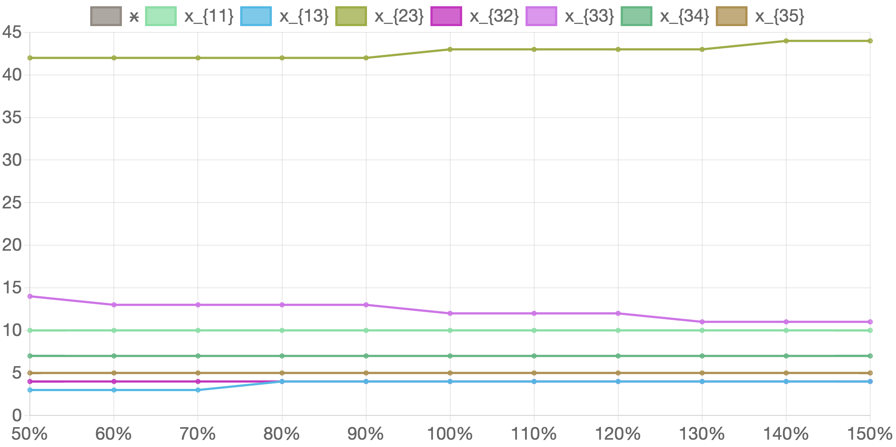

У таблиці 6.3. наведено значення змінних які будуть змінюватися у ході експерименту зі зміни продуктивності на підприємствах 2-го типу. Кількість вироблених комплектів виробів та розподіл виробничої програми між підприємствами   наведено у таблиці 6.4. Відповідні графіки наведено на рисунку 6.2.

#### Таблиця 6.3. Вихідні значення експерименту при зміні продуктивності виробництва на підприємствах 2-го типу для усіх типів продуктів у відсотках від початкових значень

<table>
    <thead>
        <tr>
            <th>Відсоток зміни продуктивності на підприємствах 2-го типу</th>
            <th>50%</th>
            <th>60%</th>
            <th>70%</th>
            <th>80%</th>
            <th>90%</th>
            <th>100%</th>
            <th>110%</th>
            <th>120%</th>
            <th>130%</th>
            <th>140%</th>
            <th>150%</th>
        </tr>
    </thead>
    <tbody>
        <tr>
            <td><math>
                                        <semantics>
                                            <mrow>
                                                <msub>
                                                    <mi>a</mi>
                                                    <mn>12</mn>
                                                </msub>
                                            </mrow>
                                            <annotation encoding="application/x-tex">a_{12}</annotation>
                                        </semantics>
                                    </math>a12​
            </td>
            <td>50</td>
            <td>60</td>
            <td>70</td>
            <td>80</td>
            <td>90</td>
            <td>100</td>
            <td>110</td>
            <td>120</td>
            <td>130</td>
            <td>140</td>
            <td>150</td>
        </tr>
        <tr>
            <td><math>
                                        <semantics>
                                            <mrow>
                                                <msub>
                                                    <mi>a</mi>
                                                    <mn>22</mn>
                                                </msub>
                                            </mrow>
                                            <annotation encoding="application/x-tex">a_{22}</annotation>
                                        </semantics>
                                    </math>a22​
            </td>
            <td>50</td>
            <td>60</td>
            <td>70</td>
            <td>80</td>
            <td>90</td>
            <td>100</td>
            <td>110</td>
            <td>120</td>
            <td>130</td>
            <td>140</td>
            <td>150</td>
        </tr>
        <tr>
            <td><math>
                                        <semantics>
                                            <mrow>
                                                <msub>
                                                    <mi>a</mi>
                                                    <mn>32</mn>
                                                </msub>
                                            </mrow>
                                            <annotation encoding="application/x-tex">a_{32}</annotation>
                                        </semantics>
                                    </math>a32​
            </td>
            <td>75</td>
            <td>90</td>
            <td>105</td>
            <td>120</td>
            <td>135</td>
            <td>150</td>
            <td>165</td>
            <td>180</td>
            <td>195</td>
            <td>210</td>
            <td>225</td>
        </tr>
    </tbody>
</table>

#### Таблиця 6.4. Значення розв'язку задачі в залежності від зміни продуктивності на підприємствах 2-го типу для усіх продуктів у відсотках від початкових значень

<table>
    <thead>
        <tr>
            <th>Відсоток зміни продуктивності на підприємствах 2-го типу</th>
            <th>50%</th>
            <th>60%</th>
            <th>70%</th>
            <th>80%</th>
            <th>90%</th>
            <th>100%</th>
            <th>110%</th>
            <th>120%</th>
            <th>130%</th>
            <th>140%</th>
            <th>150%</th>
        </tr>
    </thead>
    <tbody>
        <tr>
            <td>x</td>
            <td>3153</td>
            <td>3169</td>
            <td>3186</td>
            <td>3202</td>
            <td>3219</td>
            <td>3235</td>
            <td>3251</td>
            <td>3268</td>
            <td>3284</td>
            <td>3300</td>
            <td>3317</td>
        </tr>
        <tr>
            <td><math>
                                        <semantics>
                                            <mrow>
                                                <msub>
                                                    <mi>x</mi>
                                                    <mn>11</mn>
                                                </msub>
                                            </mrow>
                                            <annotation encoding="application/x-tex">x_{11}</annotation>
                                        </semantics>
                                    </math>x11​
            </td>
            <td>10</td>
            <td>10</td>
            <td>10</td>
            <td>10</td>
            <td>10</td>
            <td>10</td>
            <td>10</td>
            <td>10</td>
            <td>10</td>
            <td>10</td>
            <td>10</td>
        </tr>
        <tr>
            <td><math>
                                        <semantics>
                                            <mrow>
                                                <msub>
                                                    <mi>x</mi>
                                                    <mn>13</mn>
                                                </msub>
                                            </mrow>
                                            <annotation encoding="application/x-tex">x_{13}</annotation>
                                        </semantics>
                                    </math>x13​
            </td>
            <td>3</td>
            <td>3</td>
            <td>3</td>
            <td>4</td>
            <td>4</td>
            <td>4</td>
            <td>4</td>
            <td>4</td>
            <td>4</td>
            <td>4</td>
            <td>4</td>
        </tr>
        <tr>
            <td><math>
                                        <semantics>
                                            <mrow>
                                                <msub>
                                                    <mi>x</mi>
                                                    <mn>23</mn>
                                                </msub>
                                            </mrow>
                                            <annotation encoding="application/x-tex">x_{23}</annotation>
                                        </semantics>
                                    </math>x23​
            </td>
            <td>42</td>
            <td>42</td>
            <td>42</td>
            <td>42</td>
            <td>42</td>
            <td>43</td>
            <td>43</td>
            <td>43</td>
            <td>43</td>
            <td>44</td>
            <td>44</td>
        </tr>
        <tr>
            <td><math>
                                        <semantics>
                                            <mrow>
                                                <msub>
                                                    <mi>x</mi>
                                                    <mn>32</mn>
                                                </msub>
                                            </mrow>
                                            <annotation encoding="application/x-tex">x_{32}</annotation>
                                        </semantics>
                                    </math>x32​
            </td>
            <td>4</td>
            <td>4</td>
            <td>4</td>
            <td>4</td>
            <td>4</td>
            <td>4</td>
            <td>4</td>
            <td>4</td>
            <td>4</td>
            <td>4</td>
            <td>4</td>
        </tr>
        <tr>
            <td><math>
                                        <semantics>
                                            <mrow>
                                                <msub>
                                                    <mi>x</mi>
                                                    <mn>33</mn>
                                                </msub>
                                            </mrow>
                                            <annotation encoding="application/x-tex">x_{33}</annotation>
                                        </semantics>
                                    </math>x33​
            </td>
            <td>14</td>
            <td>13</td>
            <td>13</td>
            <td>13</td>
            <td>13</td>
            <td>12</td>
            <td>12</td>
            <td>12</td>
            <td>11</td>
            <td>11</td>
            <td>11</td>
        </tr>
        <tr>
            <td><math>
                                        <semantics>
                                            <mrow>
                                                <msub>
                                                    <mi>x</mi>
                                                    <mn>34</mn>
                                                </msub>
                                            </mrow>
                                            <annotation encoding="application/x-tex">x_{34}</annotation>
                                        </semantics>
                                    </math>x34​
            </td>
            <td>7</td>
            <td>7</td>
            <td>7</td>
            <td>7</td>
            <td>7</td>
            <td>7</td>
            <td>7</td>
            <td>7</td>
            <td>7</td>
            <td>7</td>
            <td>7</td>
        </tr>
        <tr>
            <td><math>
                                        <semantics>
                                            <mrow>
                                                <msub>
                                                    <mi>x</mi>
                                                    <mn>35</mn>
                                                </msub>
                                            </mrow>
                                            <annotation encoding="application/x-tex">x_{35}</annotation>
                                        </semantics>
                                    </math>x35​
            </td>
            <td>5</td>
            <td>5</td>
            <td>5</td>
            <td>5</td>
            <td>5</td>
            <td>5</td>
            <td>5</td>
            <td>5</td>
            <td>5</td>
            <td>5</td>
            <td>5</td>
        </tr>
    </tbody>
</table>

#### Рисунок 6.2. Графік змін розв'язку задачі в залежності від зміни продуктивності на підприємствах 2-го типу для усіх продуктів у відсотках від початкових значень

Як можна побачити з отриманих даних зміна продуктивності підприємств другого типу не здійснює значного впливу ні на кількість вироблених комплектів виробів, ні на розподіл виробничої програми між підприємствами. 

При зменшенні продуктивності на 50% кількість вироблених комплектів знижується лише приблизно на 3%. Щодо розподілу виробничої програми, трохи зростає кількість підприємств третього типу, які орієнтовані на виготовлення виробу третього типу, та відповідно знижується кількість підприємств третього типу, орієнтованих на виготовлення виробів першого та другого типів. При збільшенні продуктивності на 50% кількість вироблених комплектів збільшується теж лише приблизно на 3%. У розподілі підприємств третього типу відбуваються відповідні незначні протилежні зміни. Розподіл підприємств першого, другого, четвертого та п'ятого типів не змінюється.