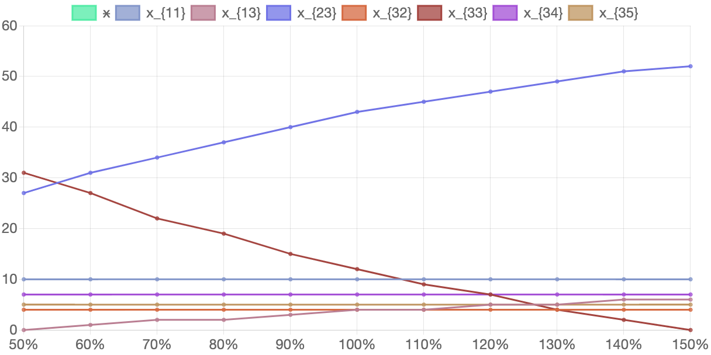

У таблиці 6.15. наведено значення змінних які будуть змінюватися у ході експерименту зі зміни продуктивності виготовлення виробу 3-го типу. Кількість вироблених комплектів виробів та розподіл виробничої програми між підприємствами наведено у таблиці 6.14. Відповідні графіки наведено на рисунку 6.7.

#### Таблиця 6.15. Вихідні значення експерименту при зміні продуктивності виробництва 3-го виробу на підприємствах усіх типів у відсотках від початкових значень

<table>
    <thead>
        <tr>
            <th>Відсоток зміни продуктивності при виробництві виробу 3-го типу</th>
            <th>50%</th>
            <th>60%</th>
            <th>70%</th>
            <th>80%</th>
            <th>90%</th>
            <th>100%</th>
            <th>110%</th>
            <th>120%</th>
            <th>130%</th>
            <th>140%</th>
            <th>150%</th>
        </tr>
    </thead>
    <tbody>
        <tr>
            <td><math>
                                        <semantics>
                                            <mrow>
                                                <msub>
                                                    <mi>a</mi>
                                                    <mn>31</mn>
                                                </msub>
                                            </mrow>
                                            <annotation encoding="application/x-tex">a_{31}</annotation>
                                        </semantics>
                                    </math>a31​
            </td>
            <td>30</td>
            <td>36</td>
            <td>42</td>
            <td>48</td>
            <td>54</td>
            <td>60</td>
            <td>66</td>
            <td>72</td>
            <td>78</td>
            <td>84</td>
            <td>90</td>
        </tr>
        <tr>
            <td><math>
                                        <semantics>
                                            <mrow>
                                                <msub>
                                                    <mi>a</mi>
                                                    <mn>32</mn>
                                                </msub>
                                            </mrow>
                                            <annotation encoding="application/x-tex">a_{32}</annotation>
                                        </semantics>
                                    </math>a32​
            </td>
            <td>75</td>
            <td>90</td>
            <td>105</td>
            <td>120</td>
            <td>135</td>
            <td>150</td>
            <td>165</td>
            <td>180</td>
            <td>195</td>
            <td>210</td>
            <td>225</td>
        </tr>
        <tr>
            <td><math>
                                        <semantics>
                                            <mrow>
                                                <msub>
                                                    <mi>a</mi>
                                                    <mn>33</mn>
                                                </msub>
                                            </mrow>
                                            <annotation encoding="application/x-tex">a_{33}</annotation>
                                        </semantics>
                                    </math>a33​
            </td>
            <td>50</td>
            <td>60</td>
            <td>70</td>
            <td>80</td>
            <td>90</td>
            <td>100</td>
            <td>110</td>
            <td>120</td>
            <td>130</td>
            <td>140</td>
            <td>150</td>
        </tr>
        <tr>
            <td><math>
                                        <semantics>
                                            <mrow>
                                                <msub>
                                                    <mi>a</mi>
                                                    <mn>34</mn>
                                                </msub>
                                            </mrow>
                                            <annotation encoding="application/x-tex">a_{34}</annotation>
                                        </semantics>
                                    </math>a34​
            </td>
            <td>150</td>
            <td>180</td>
            <td>210</td>
            <td>240</td>
            <td>270</td>
            <td>300</td>
            <td>330</td>
            <td>360</td>
            <td>390</td>
            <td>420</td>
            <td>450</td>
        </tr>
        <tr>
            <td><math>
                                        <semantics>
                                            <mrow>
                                                <msub>
                                                    <mi>a</mi>
                                                    <mn>35</mn>
                                                </msub>
                                            </mrow>
                                            <annotation encoding="application/x-tex">a_{35}</annotation>
                                        </semantics>
                                    </math>a35​
            </td>
            <td>250</td>
            <td>300</td>
            <td>350</td>
            <td>400</td>
            <td>450</td>
            <td>500</td>
            <td>550</td>
            <td>600</td>
            <td>650</td>
            <td>700</td>
            <td>750</td>
        </tr>
    </tbody>
</table>

Кількість вироблених комплектів виробів та розподіл виробничої програми між підприємствами при зміні продуктивності виробництва 3-го виробу наведено у таблиці 6.16. Відповідні графіки наведено на рисунку 6.8.

#### Таблиця 6.16. Значення розв'язку задачі в залежності від зміни продуктивності виробництва 3-го виробу на підприємствах усіх типів у відсотках від початкових значень

<table>
    <thead>
        <tr>
            <th>Відсоток зміни продуктивності при виробництві виробу 3-го типу</th>
            <th>50%</th>
            <th>60%</th>
            <th>70%</th>
            <th>80%</th>
            <th>90%</th>
            <th>100%</th>
            <th>110%</th>
            <th>120%</th>
            <th>130%</th>
            <th>140%</th>
            <th>150%</th>
        </tr>
    </thead>
    <tbody>
        <tr>
            <td>x</td>
            <td>2093</td>
            <td>2372</td>
            <td>2622</td>
            <td>2847</td>
            <td>3050</td>
            <td>3235</td>
            <td>3404</td>
            <td>3559</td>
            <td>3701</td>
            <td>3832</td>
            <td>3954</td>
        </tr>
        <tr>
            <td><math>
                                        <semantics>
                                            <mrow>
                                                <msub>
                                                    <mi>x</mi>
                                                    <mn>11</mn>
                                                </msub>
                                            </mrow>
                                            <annotation encoding="application/x-tex">x_{11}</annotation>
                                        </semantics>
                                    </math>x11​
            </td>
            <td>10</td>
            <td>10</td>
            <td>10</td>
            <td>10</td>
            <td>10</td>
            <td>10</td>
            <td>10</td>
            <td>10</td>
            <td>10</td>
            <td>10</td>
            <td>10</td>
        </tr>
        <tr>
            <td><math>
                                        <semantics>
                                            <mrow>
                                                <msub>
                                                    <mi>x</mi>
                                                    <mn>13</mn>
                                                </msub>
                                            </mrow>
                                            <annotation encoding="application/x-tex">x_{13}</annotation>
                                        </semantics>
                                    </math>x13​
            </td>
            <td>0</td>
            <td>1</td>
            <td>2</td>
            <td>2</td>
            <td>3</td>
            <td>4</td>
            <td>4</td>
            <td>5</td>
            <td>5</td>
            <td>6</td>
            <td>6</td>
        </tr>
        <tr>
            <td><math>
                                        <semantics>
                                            <mrow>
                                                <msub>
                                                    <mi>x</mi>
                                                    <mn>23</mn>
                                                </msub>
                                            </mrow>
                                            <annotation encoding="application/x-tex">x_{23}</annotation>
                                        </semantics>
                                    </math>x23​
            </td>
            <td>27</td>
            <td>31</td>
            <td>34</td>
            <td>37</td>
            <td>40</td>
            <td>43</td>
            <td>45</td>
            <td>47</td>
            <td>49</td>
            <td>51</td>
            <td>52</td>
        </tr>
        <tr>
            <td><math>
                                        <semantics>
                                            <mrow>
                                                <msub>
                                                    <mi>x</mi>
                                                    <mn>32</mn>
                                                </msub>
                                            </mrow>
                                            <annotation encoding="application/x-tex">x_{32}</annotation>
                                        </semantics>
                                    </math>x32​
            </td>
            <td>4</td>
            <td>4</td>
            <td>4</td>
            <td>4</td>
            <td>4</td>
            <td>4</td>
            <td>4</td>
            <td>4</td>
            <td>4</td>
            <td>4</td>
            <td>4</td>
        </tr>
        <tr>
            <td><math>
                                        <semantics>
                                            <mrow>
                                                <msub>
                                                    <mi>x</mi>
                                                    <mn>33</mn>
                                                </msub>
                                            </mrow>
                                            <annotation encoding="application/x-tex">x_{33}</annotation>
                                        </semantics>
                                    </math>x33​
            </td>
            <td>31</td>
            <td>27</td>
            <td>22</td>
            <td>19</td>
            <td>15</td>
            <td>12</td>
            <td>9</td>
            <td>7</td>
            <td>4</td>
            <td>2</td>
            <td>0</td>
        </tr>
        <tr>
            <td><math>
                                        <semantics>
                                            <mrow>
                                                <msub>
                                                    <mi>x</mi>
                                                    <mn>34</mn>
                                                </msub>
                                            </mrow>
                                            <annotation encoding="application/x-tex">x_{34}</annotation>
                                        </semantics>
                                    </math>x34​
            </td>
            <td>7</td>
            <td>7</td>
            <td>7</td>
            <td>7</td>
            <td>7</td>
            <td>7</td>
            <td>7</td>
            <td>7</td>
            <td>7</td>
            <td>7</td>
            <td>7</td>
        </tr>
        <tr>
            <td><math>
                                        <semantics>
                                            <mrow>
                                                <msub>
                                                    <mi>x</mi>
                                                    <mn>35</mn>
                                                </msub>
                                            </mrow>
                                            <annotation encoding="application/x-tex">x_{35}</annotation>
                                        </semantics>
                                    </math>x35​
            </td>
            <td>5</td>
            <td>5</td>
            <td>5</td>
            <td>5</td>
            <td>5</td>
            <td>5</td>
            <td>5</td>
            <td>5</td>
            <td>5</td>
            <td>5</td>
            <td>5</td>
        </tr>
    </tbody>
</table>

#### Рисунок 6.8. Графік змін розв'язку задачі в залежності від зміни продуктивності виробництва 3-го виробу на підприємствах усіх типів у відсотках від початкових значень

Як можна побачити з отриманих даних зміна продуктивності виробництва 3-го виробу досить суттєво впливає як на кількість вироблених комплектів виробів, так і на розподіл виробничої програми між підприємствами. 

При зменшенні продуктивності на 50% кількість вироблених комплектів знижується приблизно на 35%. Щодо розподілу виробничої програми, зростає кількість підприємств третього типу, які орієнтовані на виготовлення виробу третього типу, та відповідно знижується кількість підприємств третього типу, орієнтованих на виготовлення виробів першого та другого типів. При збільшенні продуктивності на 50% кількість вироблених комплектів збільшується теж лише приблизно на 35%. У розподілі підприємств третього типу відбуваються відповідні протилежні зміни. Розподіл підприємств першого, другого, четвертого та п'ятого типів не змінюється.
