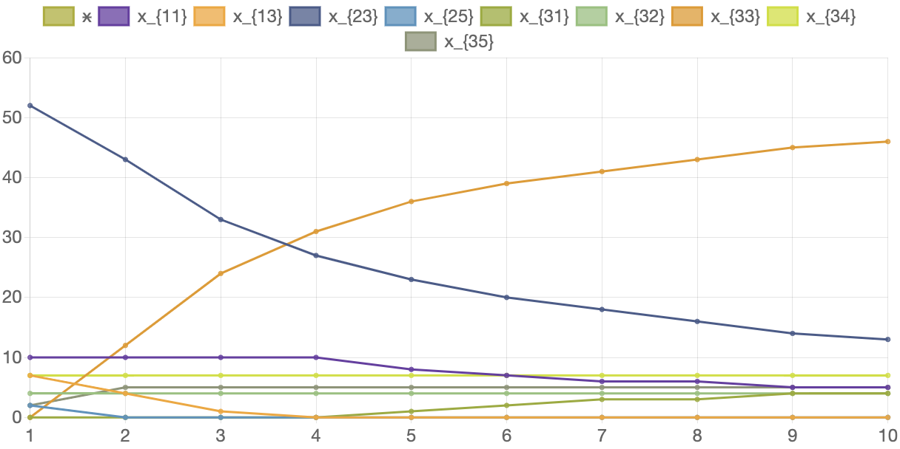

Кількість вироблених комплектів виробів та розподіл виробничої програми між підприємствами при зміні кількості виробів 3-го типу у комплекті наведено у таблиці 6.19. Відповідні графіки наведено на рисунку 6.11.

#### Таблиця 6.19. Значення розв'язку задачі в залежності від кількості виробів 3-го типу у комплекті

<table>
    <thead>
        <tr>
            <th>Кількість виробів 3-го типу у комплекті</th>
            <th>1</th>
            <th>2</th>
            <th>3</th>
            <th>4</th>
            <th>5</th>
            <th>6</th>
            <th>7</th>
            <th>8</th>
            <th>9</th>
            <th>10</th>
        </tr>
    </thead>
    <tbody>
        <tr>
            <td>x</td>
            <td>4164</td>
            <td>3235</td>
            <td>2541</td>
            <td>2093</td>
            <td>1777</td>
            <td>1544</td>
            <td>1365</td>
            <td>1223</td>
            <td>1108</td>
            <td>1013</td>
        </tr>
        <tr>
            <td><math>
                                        <semantics>
                                            <mrow>
                                                <msub>
                                                    <mi>x</mi>
                                                    <mn>11</mn>
                                                </msub>
                                            </mrow>
                                            <annotation encoding="application/x-tex">x_{11}</annotation>
                                        </semantics>
                                    </math>x11​
            </td>
            <td>10</td>
            <td>10</td>
            <td>10</td>
            <td>10</td>
            <td>8</td>
            <td>7</td>
            <td>6</td>
            <td>6</td>
            <td>5</td>
            <td>5</td>
        </tr>
        <tr>
            <td><math>
                                        <semantics>
                                            <mrow>
                                                <msub>
                                                    <mi>x</mi>
                                                    <mn>13</mn>
                                                </msub>
                                            </mrow>
                                            <annotation encoding="application/x-tex">x_{13}</annotation>
                                        </semantics>
                                    </math>x13​
            </td>
            <td>7</td>
            <td>4</td>
            <td>1</td>
            <td>0</td>
            <td>0</td>
            <td>0</td>
            <td>0</td>
            <td>0</td>
            <td>0</td>
            <td>0</td>
        </tr>
        <tr>
            <td><math>
                                        <semantics>
                                            <mrow>
                                                <msub>
                                                    <mi>x</mi>
                                                    <mn>23</mn>
                                                </msub>
                                            </mrow>
                                            <annotation encoding="application/x-tex">x_{23}</annotation>
                                        </semantics>
                                    </math>x23​
            </td>
            <td>52</td>
            <td>43</td>
            <td>33</td>
            <td>27</td>
            <td>23</td>
            <td>20</td>
            <td>18</td>
            <td>16</td>
            <td>14</td>
            <td>13</td>
        </tr>
        <tr>
            <td><math>
                                        <semantics>
                                            <mrow>
                                                <msub>
                                                    <mi>x</mi>
                                                    <mn>25</mn>
                                                </msub>
                                            </mrow>
                                            <annotation encoding="application/x-tex">x_{25}</annotation>
                                        </semantics>
                                    </math>x25​
            </td>
            <td>2</td>
            <td>0</td>
            <td>0</td>
            <td>0</td>
            <td>0</td>
            <td>0</td>
            <td>0</td>
            <td>0</td>
            <td>0</td>
            <td>0</td>
        </tr>
        <tr>
            <td><math>
                                        <semantics>
                                            <mrow>
                                                <msub>
                                                    <mi>x</mi>
                                                    <mn>31</mn>
                                                </msub>
                                            </mrow>
                                            <annotation encoding="application/x-tex">x_{31}</annotation>
                                        </semantics>
                                    </math>x31​
            </td>
            <td>0</td>
            <td>0</td>
            <td>0</td>
            <td>0</td>
            <td>1</td>
            <td>2</td>
            <td>3</td>
            <td>3</td>
            <td>4</td>
            <td>4</td>
        </tr>
        <tr>
            <td><math>
                                        <semantics>
                                            <mrow>
                                                <msub>
                                                    <mi>x</mi>
                                                    <mn>32</mn>
                                                </msub>
                                            </mrow>
                                            <annotation encoding="application/x-tex">x_{32}</annotation>
                                        </semantics>
                                    </math>x32​
            </td>
            <td>4</td>
            <td>4</td>
            <td>4</td>
            <td>4</td>
            <td>4</td>
            <td>4</td>
            <td>4</td>
            <td>4</td>
            <td>4</td>
            <td>4</td>
        </tr>
        <tr>
            <td><math>
                                        <semantics>
                                            <mrow>
                                                <msub>
                                                    <mi>x</mi>
                                                    <mn>33</mn>
                                                </msub>
                                            </mrow>
                                            <annotation encoding="application/x-tex">x_{33}</annotation>
                                        </semantics>
                                    </math>x33​
            </td>
            <td>0</td>
            <td>12</td>
            <td>24</td>
            <td>31</td>
            <td>36</td>
            <td>39</td>
            <td>41</td>
            <td>43</td>
            <td>45</td>
            <td>46</td>
        </tr>
        <tr>
            <td><math>
                                        <semantics>
                                            <mrow>
                                                <msub>
                                                    <mi>x</mi>
                                                    <mn>34</mn>
                                                </msub>
                                            </mrow>
                                            <annotation encoding="application/x-tex">x_{34}</annotation>
                                        </semantics>
                                    </math>x34​
            </td>
            <td>7</td>
            <td>7</td>
            <td>7</td>
            <td>7</td>
            <td>7</td>
            <td>7</td>
            <td>7</td>
            <td>7</td>
            <td>7</td>
            <td>7</td>
        </tr>
        <tr>
            <td><math>
                                        <semantics>
                                            <mrow>
                                                <msub>
                                                    <mi>x</mi>
                                                    <mn>35</mn>
                                                </msub>
                                            </mrow>
                                            <annotation encoding="application/x-tex">x_{35}</annotation>
                                        </semantics>
                                    </math>x35​
            </td>
            <td>2</td>
            <td>5</td>
            <td>5</td>
            <td>5</td>
            <td>5</td>
            <td>5</td>
            <td>5</td>
            <td>5</td>
            <td>5</td>
            <td>5</td>
        </tr>
    </tbody>
</table>

#### Рисунок 6.11. Графік змін розв'язку задачі в залежності від кількості виробів 3-го типу у комплекті.

Як можна побачити з отриманих даних зміна кількості виробів 3-го типу у комплекті значною мірою впливає на кількість вироблених комплектів виробів, а також і на розподіл виробничої програми між підприємствами.  

При збільшенні кількості виробів 3-го типу з 1 до 10 кількість вироблених комплектів знижується приблизно на 70%. Щодо розподілу виробничої програми, зростає кількість підприємств третього типу, які орієнтовані на виготовлення виробу третього типу, та відповідно знижується кількість підприємств третього типу, орієнтованих на виготовлення виробів другого типу. Кількість підприємств третього типу, які орієнтовані на виготовлення виробу першого типу знижується до нуля. Розподіл підприємств другого та четвертого типів не змінюється.
