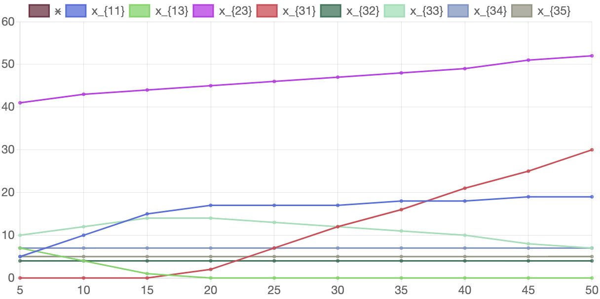

Кількість вироблених комплектів виробів та розподіл виробничої програми між підприємствами при зміні кількості підприємств 1-го типу наведено у таблиці 6.20. Відповідні графіки наведено на рисунку 6.12.

#### Таблиця 6.20. Значення розв'язку задачі в залежності від кількості підприємств 1-го типу

<table>
    <thead>
        <tr>
            <th>Кількість підприємств 1-го типу </th>
            <th>5</th>
            <th>10</th>
            <th>15</th>
            <th>20</th>
            <th>25</th>
            <th>30</th>
            <th>35</th>
            <th>40</th>
            <th>45</th>
            <th>50</th>
        </tr>
    </thead>
    <tbody>
        <tr>
            <td>x</td>
            <td>3144</td>
            <td>3235</td>
            <td>3326</td>
            <td>3411</td>
            <td>3494</td>
            <td>3576</td>
            <td>3659</td>
            <td>3742</td>
            <td>3824</td>
            <td>3907</td>
        </tr>
        <tr>
            <td><math>
                                        <semantics>
                                            <mrow>
                                                <msub>
                                                    <mi>x</mi>
                                                    <mn>11</mn>
                                                </msub>
                                            </mrow>
                                            <annotation encoding="application/x-tex">x_{11}</annotation>
                                        </semantics>
                                    </math>x11​
            </td>
            <td>5</td>
            <td>10</td>
            <td>15</td>
            <td>17</td>
            <td>17</td>
            <td>17</td>
            <td>18</td>
            <td>18</td>
            <td>19</td>
            <td>19</td>
        </tr>
        <tr>
            <td><math>
                                        <semantics>
                                            <mrow>
                                                <msub>
                                                    <mi>x</mi>
                                                    <mn>13</mn>
                                                </msub>
                                            </mrow>
                                            <annotation encoding="application/x-tex">x_{13}</annotation>
                                        </semantics>
                                    </math>x13​
            </td>
            <td>7</td>
            <td>4</td>
            <td>1</td>
            <td>0</td>
            <td>0</td>
            <td>0</td>
            <td>0</td>
            <td>0</td>
            <td>0</td>
            <td>0</td>
        </tr>
        <tr>
            <td><math>
                                        <semantics>
                                            <mrow>
                                                <msub>
                                                    <mi>x</mi>
                                                    <mn>23</mn>
                                                </msub>
                                            </mrow>
                                            <annotation encoding="application/x-tex">x_{23}</annotation>
                                        </semantics>
                                    </math>x23​
            </td>
            <td>41</td>
            <td>43</td>
            <td>44</td>
            <td>45</td>
            <td>46</td>
            <td>47</td>
            <td>48</td>
            <td>49</td>
            <td>51</td>
            <td>52</td>
        </tr>
        <tr>
            <td><math>
                                        <semantics>
                                            <mrow>
                                                <msub>
                                                    <mi>x</mi>
                                                    <mn>31</mn>
                                                </msub>
                                            </mrow>
                                            <annotation encoding="application/x-tex">x_{31}</annotation>
                                        </semantics>
                                    </math>x31​
            </td>
            <td>0</td>
            <td>0</td>
            <td>0</td>
            <td>2</td>
            <td>7</td>
            <td>12</td>
            <td>16</td>
            <td>21</td>
            <td>25</td>
            <td>30</td>
        </tr>
        <tr>
            <td><math>
                                        <semantics>
                                            <mrow>
                                                <msub>
                                                    <mi>x</mi>
                                                    <mn>32</mn>
                                                </msub>
                                            </mrow>
                                            <annotation encoding="application/x-tex">x_{32}</annotation>
                                        </semantics>
                                    </math>x32​
            </td>
            <td>4</td>
            <td>4</td>
            <td>4</td>
            <td>4</td>
            <td>4</td>
            <td>4</td>
            <td>4</td>
            <td>4</td>
            <td>4</td>
            <td>4</td>
        </tr>
        <tr>
            <td><math>
                                        <semantics>
                                            <mrow>
                                                <msub>
                                                    <mi>x</mi>
                                                    <mn>33</mn>
                                                </msub>
                                            </mrow>
                                            <annotation encoding="application/x-tex">x_{33}</annotation>
                                        </semantics>
                                    </math>x33​
            </td>
            <td>10</td>
            <td>12</td>
            <td>14</td>
            <td>14</td>
            <td>13</td>
            <td>12</td>
            <td>11</td>
            <td>10</td>
            <td>8</td>
            <td>7</td>
        </tr>
        <tr>
            <td><math>
                                        <semantics>
                                            <mrow>
                                                <msub>
                                                    <mi>x</mi>
                                                    <mn>34</mn>
                                                </msub>
                                            </mrow>
                                            <annotation encoding="application/x-tex">x_{34}</annotation>
                                        </semantics>
                                    </math>x34​
            </td>
            <td>7</td>
            <td>7</td>
            <td>7</td>
            <td>7</td>
            <td>7</td>
            <td>7</td>
            <td>7</td>
            <td>7</td>
            <td>7</td>
            <td>7</td>
        </tr>
        <tr>
            <td><math>
                                        <semantics>
                                            <mrow>
                                                <msub>
                                                    <mi>x</mi>
                                                    <mn>35</mn>
                                                </msub>
                                            </mrow>
                                            <annotation encoding="application/x-tex">x_{35}</annotation>
                                        </semantics>
                                    </math>x35​
            </td>
            <td>5</td>
            <td>5</td>
            <td>5</td>
            <td>5</td>
            <td>5</td>
            <td>5</td>
            <td>5</td>
            <td>5</td>
            <td>5</td>
            <td>5</td>
        </tr>
    </tbody>
</table>

#### Рисунок 6.12. Графік змін розв'язку задачі в залежності від кількості підприємств 1-го типу.

Як можна побачити з отриманих даних зміна кількості підприємств 1-го типу впливає на кількість вироблених комплектів підприємств, а також і на розподіл виробничої програми між підприємствами. 

При збільшенні кількості підприємств 1-го типу з 5 до 50 кількість вироблених комплектів збільшується приблизно на 24%. Щодо розподілу виробничої програми, зростає кількість підприємств третього типу, які орієнтовані на виготовлення виробу другого типу, та відповідно знижується кількість підприємств третього типу, орієнтованих на виготовлення виробів першого та третього типів. Розподіл підприємств другого, четвертого та п'ятого типів не змінюється. Розподіл підприємств першого типу змінюється незначною мірою.

Нижче у таблицях та графіках представлені зміни кількості вироблених комплектів виробів та розподілу виробничої програми між підприємствами при зміні кількості підприємств другого, третього, четвертого та п'ятого типів.