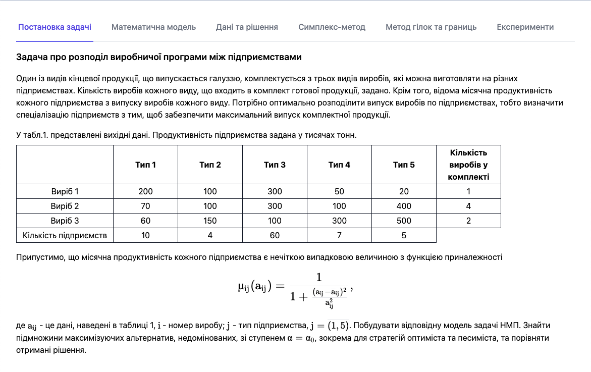
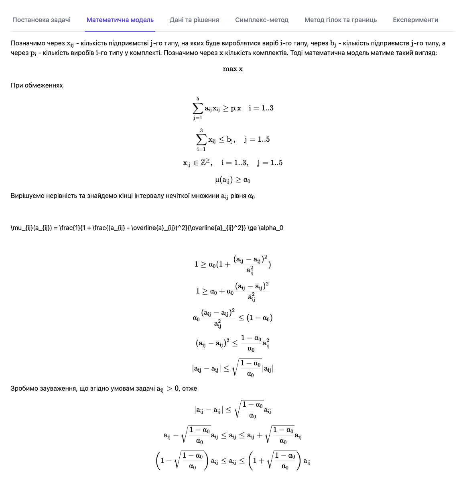
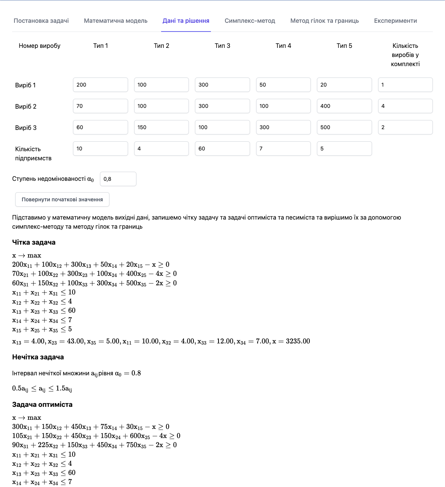
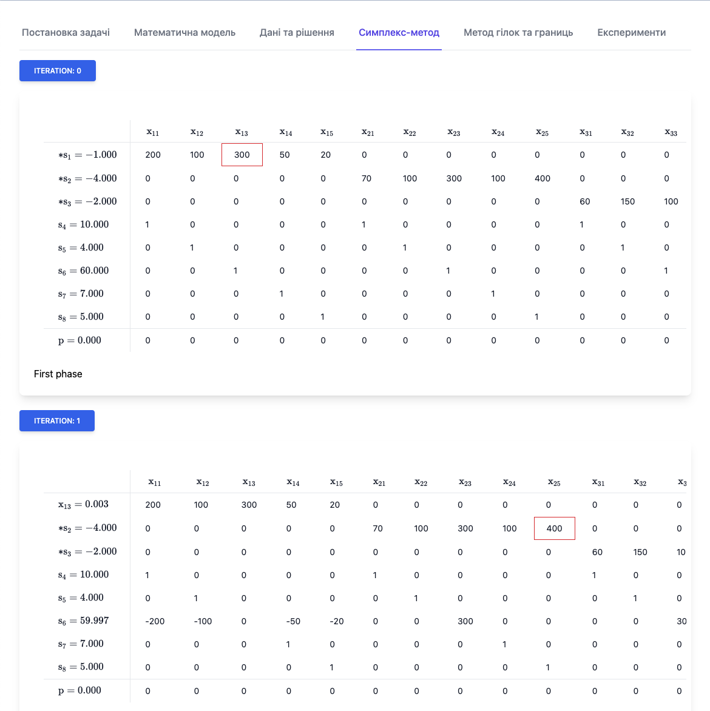
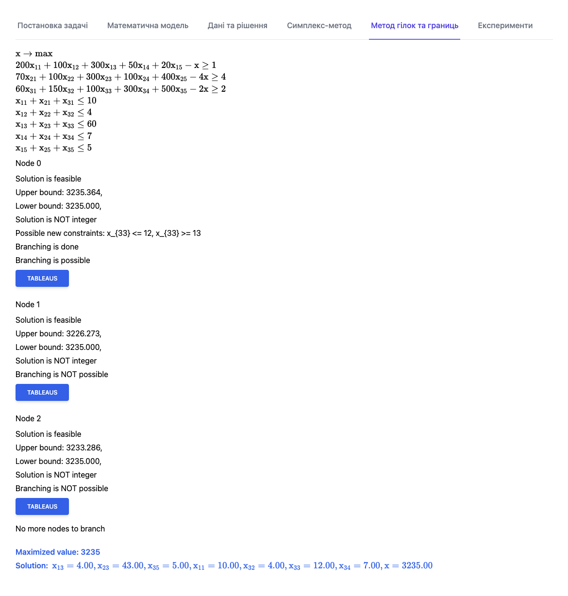
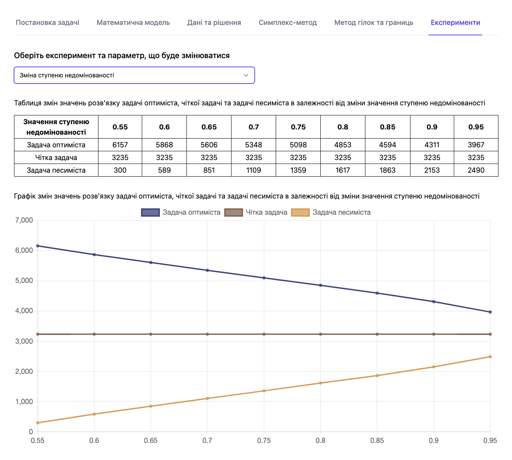

# 7. опис розробленої програми 

## 7.1. Вибір засобів розробки

При розробці програмного продукту у рамках даної роботи були вирішені питання вибору засобів розробки, імплементації алгоритмів, забезпечення можливості проведення експериментів та реалізації зручного інтерфейсу користувача.

Нами було вирішено реалізувати програмний продукт, призначений для вирішення класу задач, який розглядається у даній роботі, у вигляді веб-додатка з огляду на декілька причин.

Веб додатки для свого виконання потребують лише браузер та підключення до інтернету. З огляду на те, що браузери існують в усіх сучасних операційних системах, веб-додатки є найбільш універсальними видами додатків. Це означає, що користувачеві не потрібно встановлювати ні сам додаток, ні додаткове програмне забезпечення, - достатньо відкрити посилання на додаток у браузері.

Другою причиною є те, що  сучасні засоби розробки веб-додатків надають безліч можливостей для створення зручного та привабливого інтерфейсу користувача.

Третьою причиною є те, що сучасні персональні комп'ютери, а зокрема і браузери, які на них виконуються, володіють значними обчислювальними потужностями у порівнянні з обсягом обчислень, потрібних для вирішення класу задач, які розглядаються у даній роботі.

Програмний продукт було створено на мові програмування TypeScript, для реалізації інтерфейсу користувача було використано бібліотеки React.js та Tailwind CSS, компоненти інтерфейсу користувача Tailwind UI. Програмний код проекту розміщено у репозиторії на сервісі GitHub. Програмний продукт опубліковано у мережі інтернет за допомогою сервісу GitHub Pages. 

## 7.2. Опис інтерфейсу користувача

Програмний продукт є доступним у мережі інтернет за посиланням https://vb-oiko.github.io/course-paper-4/. Інтерфейс програми складається з шести вкладок. Після завантаження сторінки користувач бачить вміст першої вкладки та назви всіх вкладок, активна вкладка (у цьому випадку перша) виділена кольором.

На першій вкладці користувач може ознайомитися з постановкою задачі, таблицею з вихідними даними та формулою функції приналежності нечіткої випадкової величини. На рисунку 7.1. представлено знімок екрану з активованою першою вкладкою.

#### Рис. 7.1. Знімок екрану програми з активованою вкладкою "Постановка задачі"

На другій вкладці користувач може ознайомитися з математичною моделлю задачі, яка розглядається у даній роботі. На рисунку 7.2. представлено знімок екрану з активованою другою вкладкою.

#   

#### Рис. 7.2. Знімок екрану програми з активованою вкладкою "Математична модель"

На третій вкладці користувач має можливість змінювати вихідні дані довільним чином, переглядати уточнену математичну модель та побачити розв'язок задачі зі зміненими даними. На рисунку 7.3. представлено знімок екрану з активованою третьою вкладкою.

#   

#### Рис. 7.3. Знімок екрану програми з активованою вкладкою "Дані та рішення"

На четвертій вкладці користувач має можливість переглянути хід розв'язку чіткої задачі без обмежень цілочисельності з вихідними даними, введеними на попередній вкладці. Користувач може переглянути симплекс таблиці, отримані на кожній ітерації двоїстого симплекс-методу. На рисунку 7.4. представлено знімок екрану з активованою четвертою вкладкою.

#   

#### Рис. 7.4. Знімок екрану програми з активованою вкладкою "Симплекс-метод"

На п'ятій вкладці користувач має можливість побачити хід розв'язку цілочисельної задачі методом гілок та границь, ознайомитись з вузлами дерева рішень та симплекс-таблицями, отриманими у ході розв'язку симплекс-методом задачі з додатковим обмеженням. На рисунку 7.5. представлено знімок екрану з активованою п'ятою вкладкою.

#   

#### Рис. 7.5. Знімок екрану програми з активованою вкладкою "Метод гілок та границь"

На шостій вкладці користувач має можливість ознайомитись з результатами експериментів. Користувач має можливість обирати серед п'яти видів експериментів. Деякі експерименти пропонують можливість вибору додаткового параметру. Експерименти та їх результати докладно розглянуті у главі 6 даної роботи. На рисунку 7.6. представлено знімок екрану з активованою шостою вкладкою.

#   

#### Рис. 7.6. Знімок екрану програми з активованою вкладкою "Експерименти"

